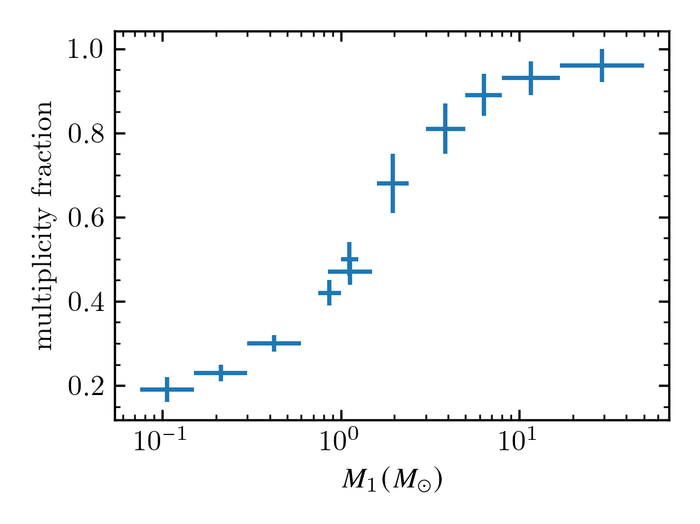
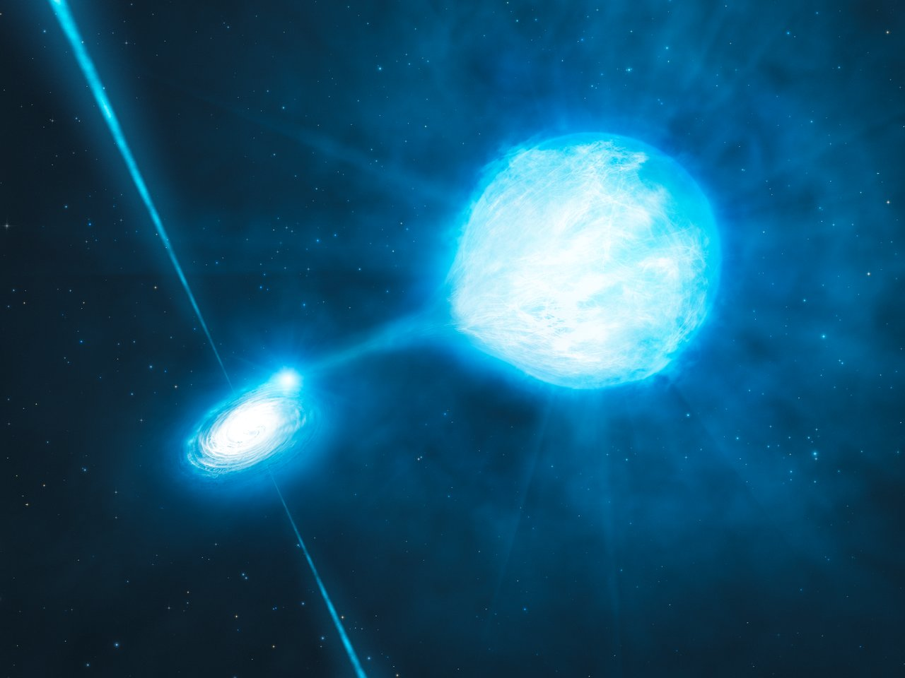

## Overview

Massive stars ($M \gtrsim 8 M_{\odot}) are overwhelmingly part of binary (or even higher order) systems.
See this figure from Offner et al. (2023) that compiles data from many multiplicity studies.

When such stars evolve, they engage is mass-transfer events, which create a whole host of astrophysical phenomena that could not be understood with single-star evolution.
One of the best examples are X-ray binaries.

**Figure 2:** Artist impression of a mass-transferring X-ray binary. The disk of the accretor becomes very hot and emits X rays.*Credit: ESO/L. Calçada/M.Kornmesser.*

This lab will introduce you to the inner workings of `MESA/binary`, and give you an understanding of how massive stars exchange mass.

## Anatomy of a binary

Simulating single stars is fun, but simulating binary stars is even _more_ fun.
MESA can do this by separately solving the equations of stellar structure on both objects, and potentially link them by invoking interaction routines.

Imagine two rows of boxes, representing the stars.
Each box is filled with the properties of the interiors ($T, \rho, r, L, X$), varying from the cores to the surfaces.
`MESA/star` is in charge of evolving those two rows of boxes by advancing the time by $\Delta t$, and solving the stellar structure equations, keeping in mind all of the required microphysics (nuclear nets, eos, opacities, mixing, etc...).
A binary star, however, is more than just its two components.
The two objects are *orbiting* each other, which requires 4 variables to fully specify (we do not care about the orbit's orientation to a potential observer):
We choose them to be the masses of the objects, the orbit's angular momentum, and its eccentricity.
$$M_1, M_2, J_{\rm orb}, e.$$
Each variable has an associated evolution equation, e.g.:
$$\frac{dM_1}{dt} = \dot{M}_{1, \rm wind} + \dot{M}_{1, \rm trans}$$

`MESA/binary`'s job is to carefully track the orbital quantities, *i.e.* compute the values $\frac{dM_1}{dt}, \frac{dJ}{dt}$, *etc.*, and check that the state of the stars is "acceptable."
For example:

1. If $\dot{M}_{1, \rm trans}=0$ and both stars do not overflow their respective Roche Lobes, we are good, as this fulfills the requirements for a non-interacting binary.
2. On the other hand, if it turns out that the evolution of donor (as reported by `MESA/star`) is such that its radius is larger than its Roche Lobe radius, the `roche_lobe` scheme of mass transfer is violated!
We have to redo the step with a higher mass-transfer rate, so that (hopefully) this reduces the radius of the donor star to just within the Roche Lobe radius.

> [!Note]
> If you'd like a slightly deeper introduction of the control flow of `MESA/binary`, you can check out [last year's Summer School dev intro](https://mesa-leuven.4d-star.org/tutorials/wednesday/morning-session/).

### How to do binaries

`MESA/binary` has its own set of controls to setup in the initial condition of the binary, manage the physics of mass transfer, tides, and it has its own set of timestep controls (for example to not let the mass-transfer rate change too quickly from model to model).
All of these controls and their defaults are listed in the [Reference under the binary defaults heading](https://docs.mesastar.org/en/25.12.1/reference.html#binary-defaults).

> [!Important]
> In this lab, you will only need to modify/enter inlist values, not play with run_binary_extras.f90. That will come in the bonus exercises and later labs.

The actual running of a binary simulation is similar to that of a single star:

1. use a work directory based on the `$MESA_DIR/binary/work` directory (you'll notice that the contents of the `make/` and `src/` folder is slightly different) so trying a binary run with the default `star/work` direction would not work.
2. do `./mk` to compile the `run_binary_extras` routines (even if they're empty/do nothing)
3. do `./rn` to start the simulation.

With the most basic concepts of `MESA/binary` out of the way, let us continue by exploring the science of massive binary stars and their interactions.

## Mass transfer cases

When stars evolve, they (generally) become bigger over time.
As soon as the most massive star evolves to fill its **Roche Lobe**, mass transfer will ensue.
Depending on the evolutionary stage of the donor, we destinguish different mass transfer *cases*.
When the donor is still hydrogen burning, we speak of case A mass transfer, while when it is core-helium burning, we have case B (there's even case C for mass transfer post core-helium exhaustion).

The main parameter controlling when mass transfer will occur is the initial orbital period.
For massive stars, the rule of thumb is that case A occurs (roughly) for initial periods under 10 days, and case B occurs between 10 and 1000 days (with case C at a small interval of even larger periods).

> [!Note]
> To get started with the binary-evolution runs of this lab, copy the contents of the binary `work` directory from `$MESA_DIR/binary/work` into your directory tree where you are running the school labs (maybe a subfolder `school/thursday_binaries/` or something).
> `cd` to it.
> You should see familiar files like `./rn` `inlist` and a `src/` directory.
> Next, download and extract the [inlist tarball](/thursday/lab1/inlists.tar) for this lab.
> Remember that `MESA` always looks for a file named `inlist` first to start reading in parameters.
> However, as is customary, we've setup up an inlist chain to read the appropriate parameters from appropriately named inlist files.

### Run 1: Case A evolution: Tidal domination

When interaction occurs during the main sequence, the initial period of the system must be small, because the stars are compact (relative to post-main-sequence (super-)giants).
We also expect tidal interaction to be very strong between stars that orbit each other so tightly.
Let's see what this does to the rotation rate of the stars in this system.

Look and search through the [inlist defaults](https://docs.mesastar.org/en/25.12.1/reference.html) to set up the following:

- Set the initial period to 5 days.
- Enable the effects of tidal synchronization. Then, set the `sync_mode` of both stars' tidal prescription to `Orb_period`.
- Load the appropriate initial stellar models, `zams35.mod` and `zams25.mod`, in the `star_job` sections of `inlist1` and `inlist2`, respectively.

Start the `MESA` run with `./mk` and `./rn`, just as you'd do for single-star evolution!

During the run, watch the following quantities in the `pgbinary` window:

1. Mass-transfer rate: How much mass is the primary dumping onto the secondary, and what is its efficiency? Is is constant over time (or model number)? Are there more than one mass-transfer phases?

look at `lg_mtransfer_rate` and its associated graph. Also watch the `eff_xfer_fraction` (the "effective transfer fraction") number.
Don't be alarmed if the `xfer_fraction` is negative when no mass transfer is happening, that is because it is naively calculated as `eff_xfer_fraction = - dot_M2 / dot_M1`, which contains contributions from the stellar winds.

You should see two distinct phases of mass transfer, case A and later case AB when the primary exhausts hydrogen and tries to become a giant.
In fact, the first mass-transfer phase is split in 2: a high mass-transfer rate *fast case A* followed by a more mellow *slow case A* where the mass transfer rate is a couple of orders of magnitude lower.



2. Luminosity profiles: Are the stars in thermal equilibrium? If not, how does this manifest?

Thermal equilibrium is defined as $\frac{dL}{dm} = \epsilon_{\rm nuc}$.
Where is nuclear burning occuring?
Compare the numbers for the `kh_timescale` and the `mdot_timescale` in the text summary of both stars.

You should see that neither star satisfies it during rapid mass-transfer phases.
The donor's luminosity profile dips significantly in the envelope, so that $\frac{dL}{dm} \ne 0,$ but we have that $\epsilon_{\rm nuc} = 0$ as no burning takes place there.
The accretor is slightly more luminous than its nuclear luminosity, due to the accretion energy it gains.
In the slow case A phase, thermal equilibrium is nearly satisfied, as the thermal timescale of the stars is much shorter than the mass-transfer timescale.



3. Rotation rates: Do the stars spin up or down significantly during mass-transfer events?

Look `omega_div_omega_crit` profiles of either star.

Tides prevent the stars from rotating close to their critical velocity!



4. How does the period evolve during the mass transfer events?
5. At the end of the run, what is the state of both of the stars? Is the secondary star significantly evolved? Also note down the carbon-core mass of the primary.

### Run 2: Case B evolution: *You spin me 'round!*

Copy the directory from case A into a new folder for case B mass transfer (so that you'll have nicely separated end models for either case).

Setup:

- Edit `inlist_project` with so that this system has an initial period of 20 days.
- Change the tides prescription from `Orb_period` to `Hut_rad`. We make this choice here because at larger periods (and thus larger separations between the stars), tides are expected to be weaker, and the prescription of Hut, P. 1981, A&A, 99, 126, is a physically motivated computation of how tides operate in the radiative envelopes of massive stars.

Run the simulation, and watch as the primary star first exhausts hydrogen before a phase of mass transfer starts.
Tasks for this run:

1. Plot the efficiency of mass transfer, and see how it evolves over the mass-transfer event

Expand the `History_panels1` in `inlist_pgbinary` by one panel, and plot the `eff_xfer_fraction` there, or add it to an already existing panel if the `_other_yaxis` is still free.
    

    ```fortran
    History_panels1_other_yaxis_name(3) = 'eff_xfer_fraction'
    History_panels1_other_ymin(3) = -1
    History_panels1_other_ymax(3) = 2
    ```

    or

    ```fortran
    History_panels1_num_panels = 4
    ...
    History_panels1_yaxis_name(4) = 'eff_xfer_fraction'
    History_panels1_ymin(4) = -1
    History_panels1_ymax(4) = 2
    ```

    


2. Convince yourself of how precisely the accretion onto the secondary is handled.

The terminal output should write things like: `fix w > w_crit: change mdot and redo`. Why would MESA write this?

MESA is changing the accretion rate of the secondary so that its rotation rate remains below $Omega_{\rm crit}$. The donor is supplying a certain amount of mass per unit time, and MESA needs to figure out how much of it to accept to keep the secondary star from spinning itself apart (ejecting the rest as a fast wind).



3. Watch the rotation rate of the secondary closely.

Do you see anything peculiar about the value of `omega_div_omega_crit`?

What is this? $\Omega/\Omega_{\rm crit} > 1$? How can this be? I though you said the mass-transfer rate made sure the star spins below critical?

MESA is doing more than just comparing the angular velocities of the surface cell alone.
Take a look at lines 845-848 of '$MESA_DIR/star/private/evolve.f90`:

```fortran
w_div_w_crit_prev = w_div_w_crit
! check the new w_div_w_crit to make sure not too large
call set_surf_avg_rotation_info(s)
w_div_w_crit = s% w_div_w_crit_avg_surf
```

What does this `set_surf_avg_rotation_info` routine do? Remember you can (recursively) search through files in UNIX with:

```bash
$MESA_DIR/star/private $> grep -rin "set_surf_avg_rotation_info"
```


MESA computes a "mass-averaged" value of the rotation rate from cells with optical depth `surf_avg_tau_min` to `surf_avg_tau`, which is 1 to 100 by default.
Since most of the mass is at optical depth 100, you can effectively read off where the $\tau=100$ surface lies; it's where `omega_div_omega_crit = 1`.



º

4. Establish what the tidal syncronization timescale is of the stars, and plot it.

Scour the list of variables that the `binary` structure keeps in memory, in `$MESA_DIR/binary/public/binary_data.inc`. Most entries you find there you can plot in `pgbinary` panels.


> [!Note]
> You might be concerned when seeing MESA spitting a large amount of errors. Do not be. This is a consequence of us pushing the limits of what the solver is able to comfortably handle, and still making this run take around 15 minutes.
> The jumps you see in the HRD of the secondary are related.
> In actual science runs, one would tighten timestep controls to prevent this from happening!

### Run 3: Case B evolution: *You spin me 'round?*
